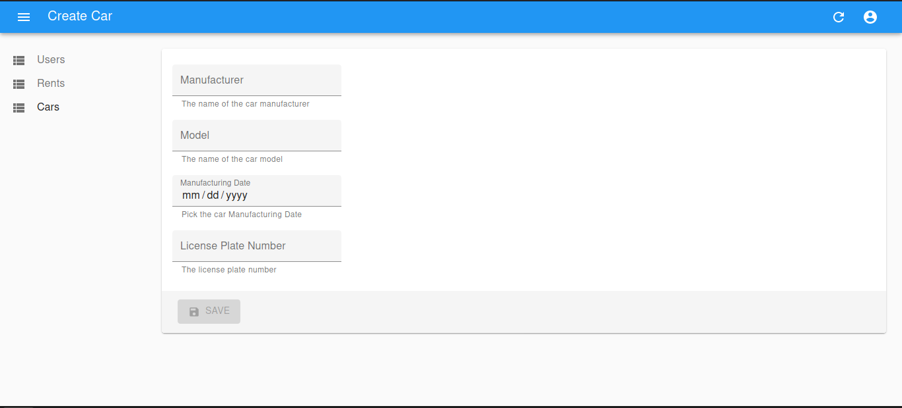

# SZFM Rent

Egy autó kölcsönző digitális rendszerének felállítása.

## Vízió

### Honnan

Egy autó bérlő cég hagyományos papír alapú nyílvántartását kellet nekünk digitálisra
faragni. Erre a rendszerre jellemző volt az átláthatatlanság, kezelhetetlenség,
 nehéz tájékozódás a rendszerben.

### Hova

Egy könnyen kezelhető, skálázható digitális megoldás létrehozása. 
Mind belős használatra, mind ügyfelek/vendégek számára.

#### Céljaink:
  - **Könnyű használhatóság**
  - **Átláthatóság**
  - **Munkafolyamatok megkönnyítése**

#### Képernyőtervek:

## Eszközök

A rendszer frontend-jéért React felelős, a backend-ért Express felel. 
Míg az adatok tárolását a MondgoDB végzi.

## Sprint 1

Admin felület létrehozása:
- CarCreate és CarEdit, CarList komponens autó létrehozására és módosítására, listázásra.
- UserCreate, UserEdit, UserList komponensek felhasználók, létrehozására módosítására listázásra.
- RentList komponens a bérlések listázására.
- Json szerver - react össze konfigolása

## Sprint 2

User frontend létrehozása:
- Header komponens létrehozása.
- CarList komponens
- Login modal
- CarCard komponens
- Regisztációs modal
- 

## Sprint 3

User Frontend-en való dolgozás:
- CarRent modal
- 2 oszlopos kiosztás

## Sprint 4

Backend felállítása és látrehozása:
  - Protected routes
  - Unprotected routes
  - CRUD metódusok implementálása
  - Frontend integrálása
  - Rental modal bug fix
  - Bootstrap-elés

## Hol tartunk most?

Az első négy hét az alkalmazás frontend és backend részének fejlesztésével történt.
Az alkalmazás 80%-os elkészültségen áll. A további hetekben a tesztelések fognak zajlani 
és hibák elhárítása. Illetve user oldali autentikáció.

### Aktuális screen shot-ok

