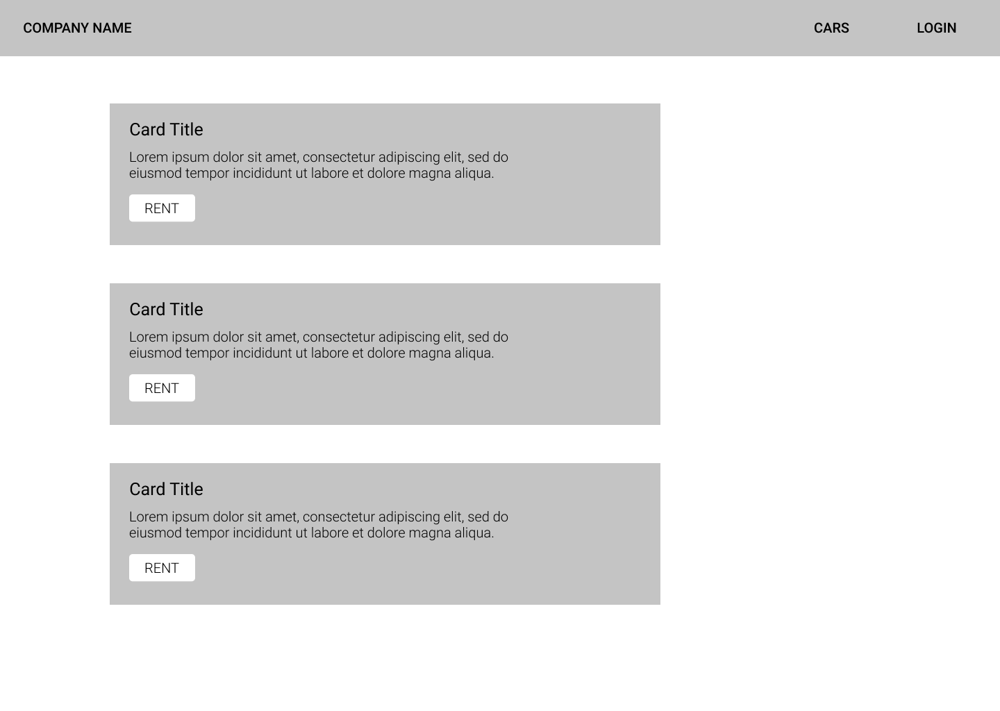
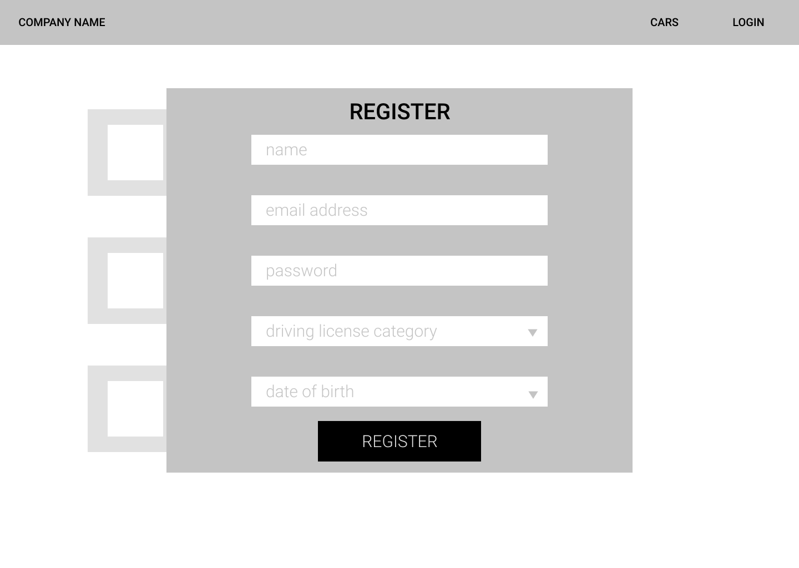
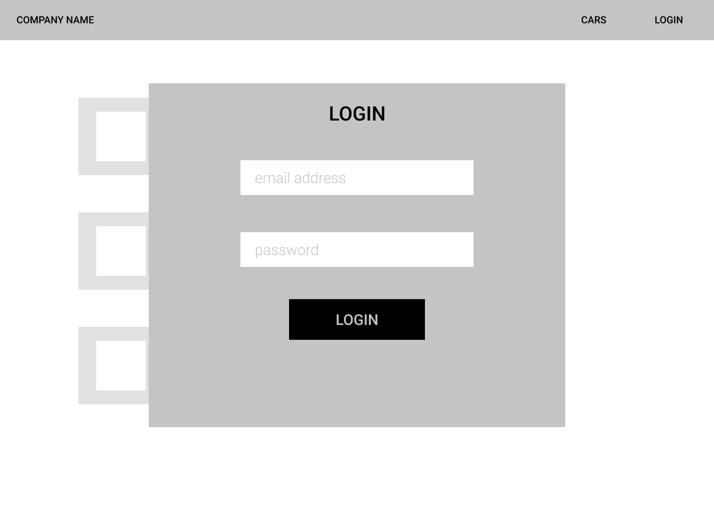
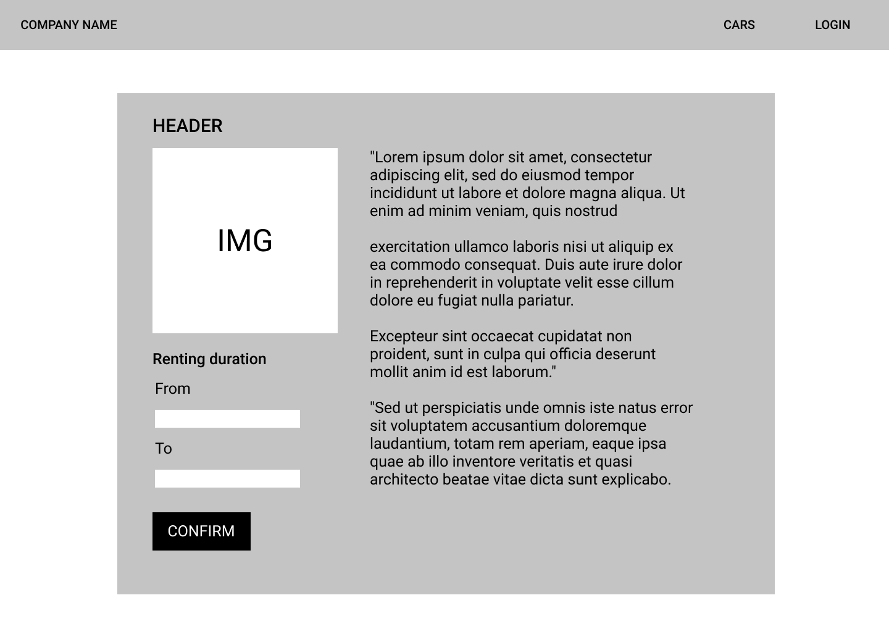

# Igényelt üzleti folyamatok modellje

## Felhasználókezelés 

## Karbantartás

## Autóbeszerzés

## Céges kapcsolattartás

# Képernyőtervek 

A képernytervek a Figma nevű web-alapú szerkesztővel készültek. 
Az alábbi tervek csak wireframe jellegűek, a projekt fő elrendezését határozzák meg, a kész dizájn ettől eltérő lehet.  

## Kezdőlap

## Regisztráció 

## Belépés

## Autó bérlés 

