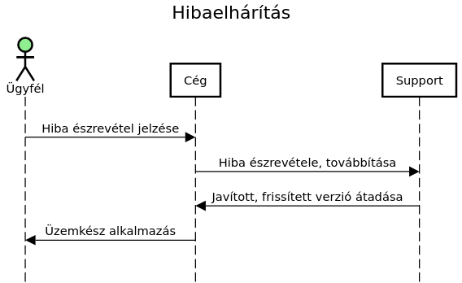
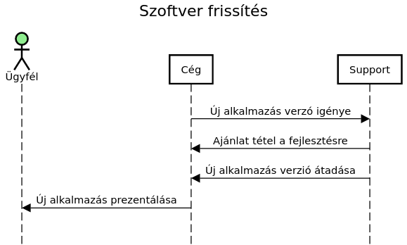
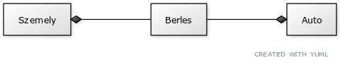
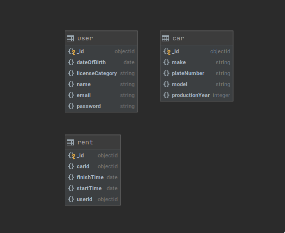

# Karbantartási terv

## Karbantartás

Hetente az aktuális bugok és hibák javítása, patchelés.
Amennyiben a fatális hiba, ami a program működését megakadályozza, akkor azonnali
elhárítás. Ha a hiba nem akadályozza a program működését, akkor az adott heti
karbantartás alkalmával orvosoljuk a hibákat.

## Szoftver frissítés folyamata

Az aktuális verzió működésben tartása, amennyiben lehetséges,
addig amíg az új verzió elkászül. Az új verzió telepítése egy kevésbé frekventált
időszakban.
Amennyiben az aktuális verzió nem tartható működésben, akkor gyors, sprintben
való fejlesztés.

# Modellek

# A rendszer célja

Rendszerünk célja roppant egyszerű. Autókölcsönző cégünknek hozunk létre egy
online alkalmazást, így a vásárlóink számára megkönnyítjük magát a kölcsönzést.
Továbbá alkalmazottaink számára is egyszerűbbek és elérhetőbbek lesznek a
szolgáltatások.

Fontos megjegyezni, hogy rendszerünkben különbséget teszünk vendég/felhasználó
illetve admin között. Azokat a felhasználókat akik még nem regisztráltak, vendégnek
hívjuk, így ők csak általános információkat láthatnak egyes gépjárművekről.

Ha a vásárló szeretné jobban átlátni egyes gépjármű állapotát/adatát, szükséges
regisztrálnia ami egy külön felületen lesz elérhető.

Külön szolgáltatást nyújtunk saját alkalmazottainknak is (admin), akik az online
rendszerben tudják ezentúl kezelni a kölcsönzéseket, nyilvántartásokat illetve
karbantartást. Ez a felület viszont a mindenképpen a "design" elé helyezi a
funkcionalitást.

# Projektterv

# Üzleti folyamatok modellje

# Követelmények

# Funkcionális terv

# Fizikai környezet

# Absztrakt domain modell

Alkalmazásunk alapvetően az MVC architekturális modell-t fogja használni. Ami nem
más mint a Modell-nézet-vezérlő programtervezési minta.

Fogalmak melyekkel tisztában kell lennünk:

* Modell: Az alkalmazás által kezelt információk tartomány-specifikus ábrázolása.
* Nézet: Megjeleníti a modellt egy megfelelő alakban, mely alkalmas a felhasználói
 interakcióra, jellemzően egy felhasználói felületi elem képében.
* Vezérlő: Az eseményeket, jellemzően felhasználói műveleteket dolgozza fel és
 válaszol rájuk.

A 3 komponens közül a modell lesz egyenlő az adatbázissal, a nézet a frontend-el
és a vezérlő a backend-el.

Így felmerül 3 új szintén fontos fogalom:

* Adatbázis: Tárolt adatok összessége.
* Frontend: A webalkalmazás azon része, melyet maga a felhasználó lát és interakcióba
tud lépni vele.
* Backend: A webalkalmazás azon része, mely az adatok feldolgozásáért felel.

### Absztrakt komponensek és kapcsolatai

#### Jelmagyarázat:

Szemely: 1 darab valós személy.
Berles: Maga az autóbérlés folyamata.
Auto: A gépjármű.

Kompozíció: "A" <>---- "B" : "B" nem létezhet "A" nélkül.

# Architekturális terv

# Implementációs terv

# Adatbázis terv

## Bevezetés

Az alkalmazás adatainak tárolására a [MongoDB](https://www.mongodb.com/) nevű adatbázist fogjuk használni.
A MongoDB egy flexibilis, jó skálázhatósággal rendelkező NoSQL  adatbázis.
Az adatokat JSON-höz hasonló dokumentumokban tárolja, az adatok
struktúrája
szempontjából nagyobb rugalmasságot biztosít, mint egy SQL adatbázis,
ugyanis nincs szükség előre definiálni a táblákat, ezek közötti kapcsolatokat.

## Kollekciók

Az adatbázis három kollekciót fog tartalmazni, amik a következőek:
+ user - a felhasználók adatai
+ car - a bérelhető autók adatai
+ rent - a bérlések adatai

## Sémák

Az adatbázis kódban való kezelésére a [mongoose](https://mongoosejs.com/) NodeJS könyvtárat fogjuk használni.
Ezzel lehetőség nyílik arra, hogy a kollekciókhoz sémákat rendeljünk hozzá, ami nagyban megkönnyíti az adatbázisba való beillesztést.

**User Séma**

    const UserSchema = new mongoose.Schema({
	    name: {
		    type: String,
		   required: true
	    },
	    email: {
		    type: String,
		    required: true
	    },
	    password: {
		    type: String,
		    required: true
	    },
	    dateOfBirth: {
		    type: Date,
		    required: true
	    },
	    licenseCategory: {
		    type: String,
		    required: true
	    },
        createdAt: {
            type: Date,
            default: Date.now()
        },
        updatedAt: {
            type: Date,
            required: false
        },
        deletedAt: {
            type: Date,
            required: false
        }
    });

**Car Séma**

    const CarSchema = new mongoose.Schema({
	    plateNumber: {
		    type: String,
		    required: true
	    },
	    make: {
		    type: String,
		    required: true
	    },
	    model: {
	    	type: String,
		    required: true
	    },
	    productionYear: {
		    type: Date,
		    required: true
	    },
        createdAt: {
            type: Date,
            default: Date.now()
        },
        updatedAt: {
            type: Date,
            required: false
        },
        deletedAt: {
            type: Date,
            required: false
        }
    });

**Rent Séma**

    const RentSchema = new mongoose.Schema({
	    carId: {
		    type: mongoose.ObjectId,
		    required: true
	    },
	    userId: {
	    	type: mongoose.ObjectId,
		    required: true
	    },
	    startTime: {
	      	type: Date,
		    required: true
	    },
	    finishTime: {
	    	type: Date,
		    required: true
	    }
    });

**Vizualizáció:**

# Telepítési terv

A rendszer telepítését Heroku segítségével fogjuk automatizáltan elvégezni.

A fejlesztés során alaposan ügyelni kell arra, hogy a `main` branchen mindig
*up-to-date* kód legyen, amely futásra kész. Ezt elősegíti a tény, hogy erre a
branchre a verziókövető rendszer nem enged módosítást pusholni, hogyha a kód
megbukik az egységteszteken, vagy attól hamarabb.

A fenti követelmény teljesülésével biztosítható, hogy a szerveren lévő kód
mindig naprakész marad, felhasználói beavatkozást a frissítés így nem igényel.

# Tesztterv

# Karbantartási terv
