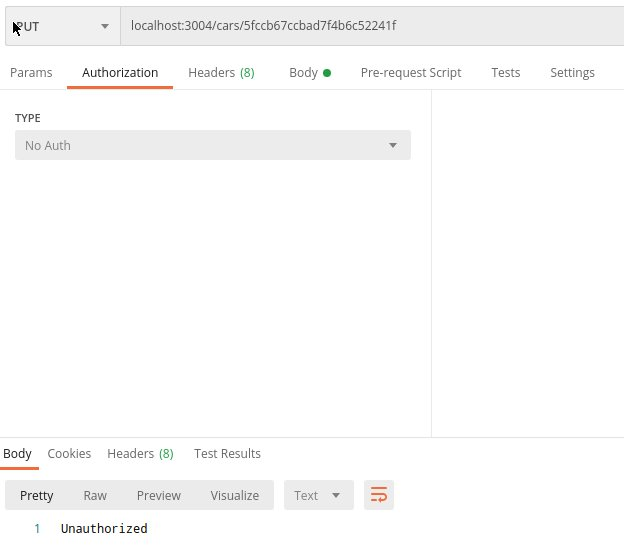

# Teszt jegyzőkönyv 

## API Endpointok manuális tesztelése 

### Tesztelés menetéről
*(Tóth Csaba)*

A tesztelés során a Backend API Endpoint-jaira alkalmazok HTTP kéréseket
a [Postman](https://www.postman.com/) alklamazással. 
A teszt során a car, user, rent endpointok lesznek tesztelve. 

### Car Endpoints 
*(Tóth Csaba)*

**GET REQUEST**

**Elvárások**: 

+ A válasz kilistázza az adatbázisban található autókat 
+ Az Car modellnek megfelelő adatokat kapunk 
+ Autentikáció nélkül is működik 

**Eredmények**

A működés az elvártnak megfelelő. 

**POST REQUEST**

**Elvárások**

+ A hozzáadott autó kerüljön be az adatbázisba 
+ A sémának nem megfelelő autó ne kerüljön be az adatbázisba 
+ Autentikáció nélkül ne lehessen autót hozzadni 

**Eredménnyek** 

A működés az elvártnak megelelő  

Autentikáció hiányában válaszként egy 401-es Unathorized Status code-ot kapunk. 

Ha nem a sémának megelelő autót küldünk, nem kerül be az adatbázisba. 

Ha a sémának megelelő autót küldünk és autentikációnk is van, 
az autó sikeresen felkerül az adatbázisba. 

**PUT REQUEST**

**Elvárások**
+ Csak autentikációval rendelkező user által hajtható végre
+ Csak valid id-val rendelkező autót lehet update-elni. 

**Eredmények** 

Autentikáció hiányában válaszként egy 401-es Unathorized Status code-ot kapunk. 

Nem létező id-val rendelkező autót nem lehet update-elni. 

Ha valid id-jű autót update-elünk a sémának megfelelően és autentikáció is van az autó adatai az elvárásoknak megfelelően frissülnek. 

**DELETE REQUEST**

**Elvárások**
+ Csak valid id-val rendelkező autót lehessen törölni 
+ Csak autentkációval rendelkező user törölhessen

**Eredmények**

Autentikáció hiányában válaszként egy 401-es Unathorized Status code-ot kapunk. 

Nem létező id-val rendelkező autót nem lehet törölni.

Ha valid id-jű autót törlünk és autentikáció is van az autó az elvárásoknak megfelelően törlődik. 

